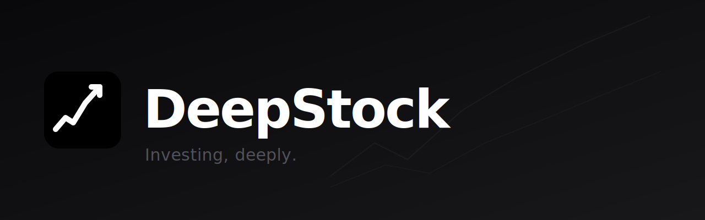

# DeepStock

Personal investing workstation for portfolio management, stock and options tracking, AI analysis, and alerting. One place for the full investing workflow — from monitoring to decision-making to record-keeping.

## Architecture

| Layer    | Stack                                                        |
| -------- | ------------------------------------------------------------ |
| Frontend | React 19, TypeScript, Vite, Tailwind CSS, shadcn/ui, TanStack Query |
| Backend  | Python 3.12, FastAPI, Pydantic v2                            |
| Data     | Supabase (PostgreSQL + Auth), Redis (cache)                  |
| AI       | Claude Sonnet via LiteLLM, Tavily (web search)               |
| Infra    | Docker Compose (backend + Redis), Vite dev server (frontend) |

All business logic lives in the backend. The frontend is a presentation layer — no calculations, no direct external API calls.

## Running

```bash
# Backend + Redis
docker compose up -d

# Frontend
cd frontend && npm run dev
```

## Conventions & patterns

See [CLAUDE.md](CLAUDE.md) — code conventions, frontend patterns, backend patterns, key file locations.

## Domain map

See [docs/source-of-truth.md](docs/source-of-truth.md) — authoritative locations for domain truths (holdings, snapshot, accounting, performance, transactions).
